# 從範本建立研究用 AI Skill

> 給研究人員的 AI Agent／Skill 建立指南

本文件說明如何從既有的 `skill-template.zip` 出發，建立適合研究工作使用的 AI Skill。即使沒有程式設計背景，也可以先用自然語言描述需求，再請 ChatGPT、Claude、Gemini、Codex 或其他具備檔案產生能力的 AI，依照範本建立完整的 Skill。

本指南整理自教學投影片〈從範本建立自己的 Skill〉，並將內容改寫為適合放在 GitHub 閱讀、維護與分享的版本。

[下載 skill-template.zip](https://github.com/chichingleetw/research-skill-template-guide/raw/main/skill-template.zip)


---

## 1. 什麼是 Skill？

Skill 可以理解成一份提供給 AI 的「工作手冊」。它會告訴 AI：

- 什麼情況下應啟用這項能力
- 任務應依照哪些步驟執行
- 是否需要分派給不同的 Agent
- 需要讀取哪些參考資料或執行哪些程式
- 最後要輸出什麼格式的成果

對研究人員而言，Skill 很像一份可重複使用的研究 SOP。建立完成後，同類型的任務就不必每次重新說明全部規則。

常見應用包括：

- 文獻搜尋與分類
- 參考文獻真偽查核
- 研究計畫書撰寫
- IRB 文件整理
- 實驗資料清理與分析
- 統計分析流程
- 合成路徑評估
- 研究報告或論文初稿產生

---

## 2. 建立 Skill 的基本策略

最容易入門的方法是：

1. 準備既有的 Skill 範本。
2. 用自然語言寫下想完成的研究任務。
3. 將範本與需求描述一起交給 AI。
4. 請 AI 產生必要的 Skill 檔案與程式碼。
5. 實際測試後，再修改需求與指令。

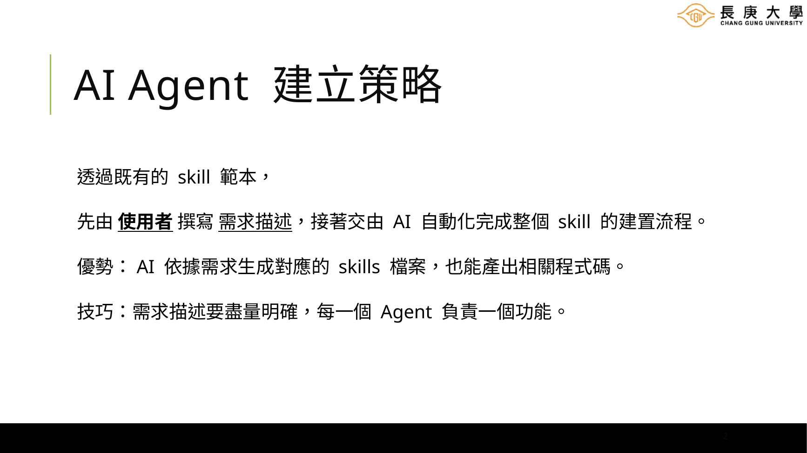

撰寫需求時，最重要的原則有兩個：

- **需求要具體**：不要只說「幫我做文獻搜尋工具」，而要說明資料來源、搜尋數量、分類方式與輸出格式。
- **一個 Agent 負責一個主要功能**：避免同一個 Agent 同時負責搜尋、分析、寫作與品質檢查。

可以把整體流程想成研究團隊的分工：

> 蒐集資料 → 產出成果 → 檢查品質

---

## 3. Skill 的資料夾架構

一個常見的 Skill 專案可以包含以下內容：

```text
專案資料夾/
├── SKILL.md
├── agents/
│   ├── agent-1.md
│   ├── agent-2.md
│   └── agent-3.md
├── scripts/
│   ├── script-1.py
│   └── script-2.py
├── references/
│   ├── guideline.pdf
│   └── terminology.md
└── assets/
    ├── report-template.md
    ├── manuscript-template.docx
    └── example-report.pdf
```

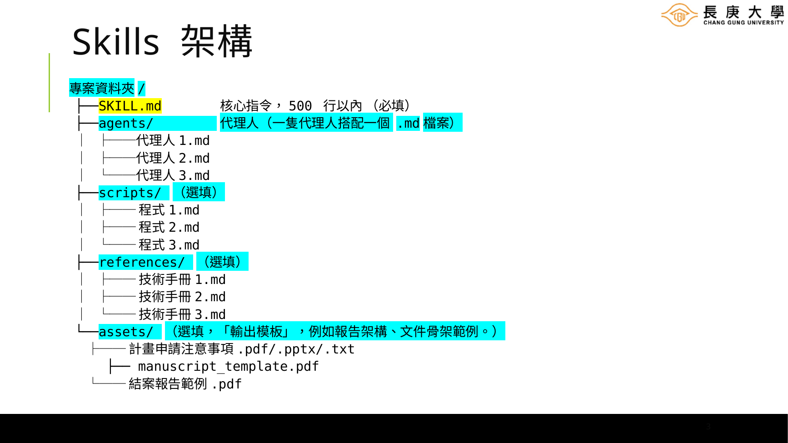

這些資料夾不必全部使用。最簡單的 Skill 只要有一個 `SKILL.md` 就可以運作。當任務變複雜時，再逐步增加 Agent、程式、參考資料與輸出模板。

### 設計原則

- **模組化**：每個檔案只負責一件主要工作。
- **漸進揭露**：只有在任務需要時，才載入額外資料。
- **平台無關**：核心指令盡量不要綁定單一 AI 平台。
- **可擴充**：先完成最小可用版本，再依測試結果增加功能。

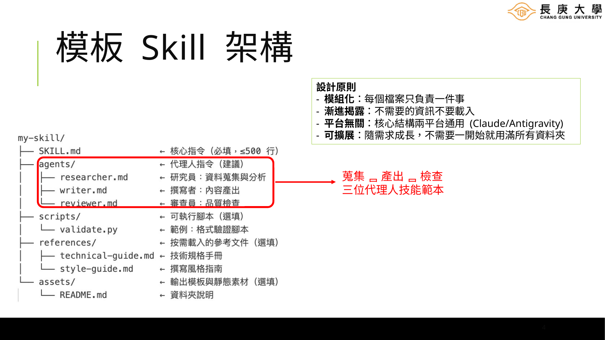

---

## 4. `SKILL.md`：Skill 的核心指令

`SKILL.md` 是整個 Skill 最重要的檔案，也是唯一必須存在的檔案。

它通常包含兩個部分：

### 4.1 YAML 標頭

檔案最前方會有一段 YAML frontmatter，用來描述 Skill 的名稱與啟用時機。

```yaml
---
name: literature-review-assistant
description: 用於釐清研究問題、搜尋學術文獻、分類摘要並產生文獻閱讀指南。
---
```

其中 `description` 特別重要，因為 AI 會根據這段文字判斷使用者的問題是否符合本 Skill 的用途。

### 4.2 主體指令

主體可以包含：

- 任務目標
- 使用時機
- 不適用情況
- 工作流程
- Agent 分工
- 各階段輸入與輸出
- 品質檢查規則
- 最終輸出格式
- 錯誤處理方式

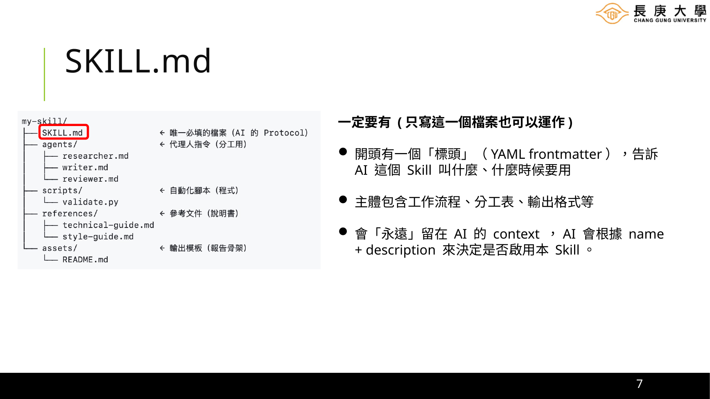

### 建議做法

- 保持內容清楚、可掃讀。
- 避免把所有背景資料都塞進 `SKILL.md`。
- 詳細方法可拆到 `agents/` 或 `references/`。
- 觸發條件要寫得具體，方便 AI 判斷何時使用。

---

## 5. `agents/`：把大任務拆成明確分工

當任務包含多個不同階段時，可以將它拆成數個 Agent。每一個 `.md` 檔案代表一位虛擬研究助理，記錄該角色的工作範圍、輸入、輸出與限制。

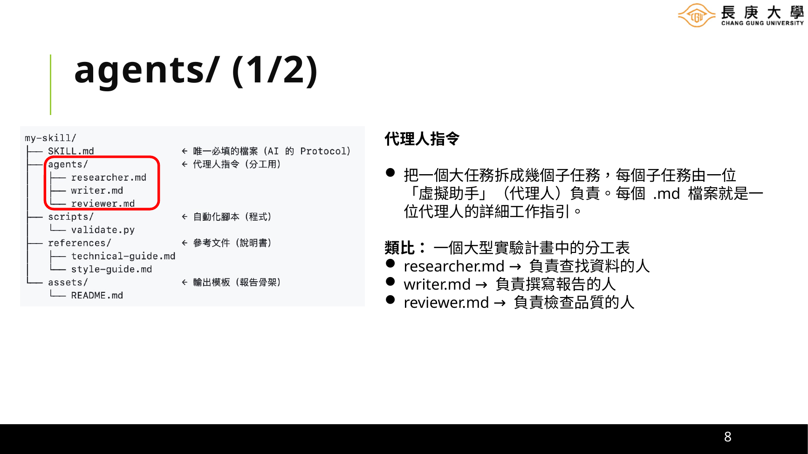

例如，一個臨床試驗文獻回顧 Skill 可以拆成：

| Agent | 主要職責 |
|---|---|
| 搜尋員 | 到 PubMed、ClinicalTrials.gov 等資料庫搜尋文獻 |
| 篩選員 | 依納入與排除條件篩選文獻 |
| 分析員 | 萃取資料、整理結果並評估偏誤風險 |

一個化學合成路徑規劃 Skill 可以拆成：

| Agent | 主要職責 |
|---|---|
| 路徑搜尋員 | 搜尋已知合成路徑與反應條件 |
| 可行性評估員 | 比較產率、成本、安全性與設備需求 |
| 報告員 | 整理比較表與推薦方案 |

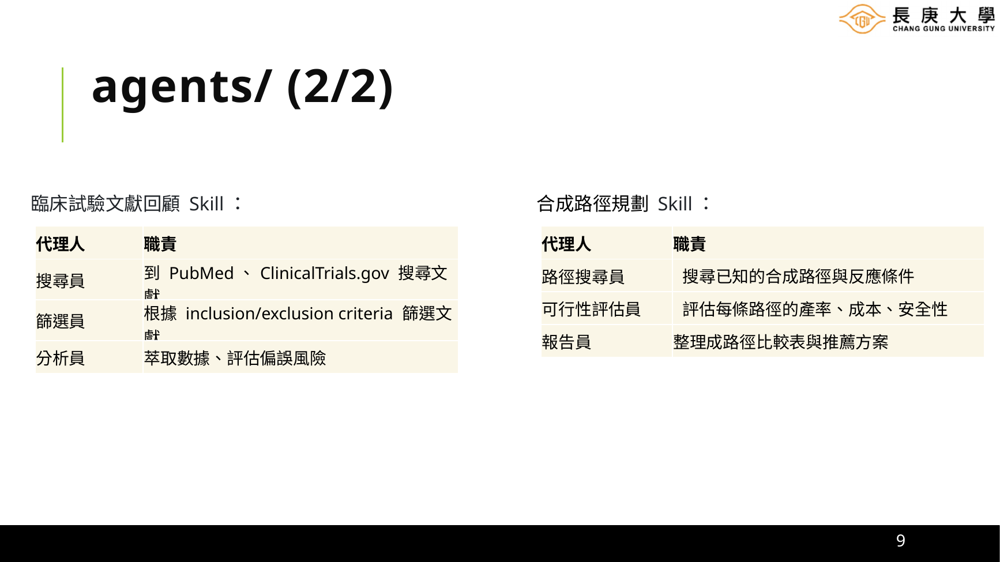

### Agent 指令至少應寫清楚

1. 角色定位
2. 接收哪些輸入
3. 執行哪些步驟
4. 不應執行哪些工作
5. 產出哪些欄位
6. 如何把結果交給下一位 Agent
7. 哪些情況需要詢問使用者
8. 哪些資訊不得自行猜測

### 不佳的分工

```text
Agent 1：幫我搜尋、分析、整理、寫報告並檢查。
```

### 較清楚的分工

```text
Agent 1：只負責釐清研究問題與產生搜尋式。
Agent 2：只負責執行搜尋、擷取書目資料與初步分類。
Agent 3：只負責摘要整理、證據比較與輸出報告。
```

---

## 6. `scripts/`：需要自動化時才加入程式

`scripts/` 用來放置 AI 可以直接執行的 Python、Shell 或其他程式。研究人員不一定要自己撰寫，可在需求中請 AI 產生。

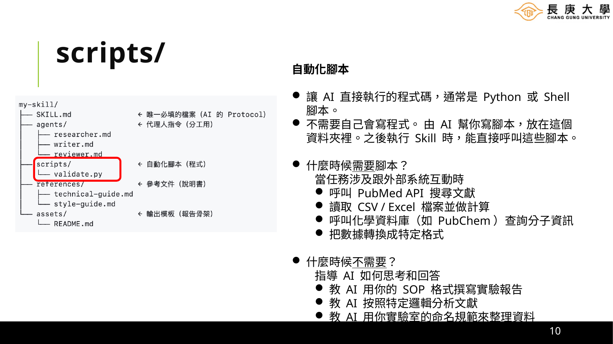

### 適合使用腳本的情況

- 呼叫 PubMed API 搜尋文獻
- 讀取 CSV、Excel 或 JSON
- 執行統計計算
- 查詢 PubChem 等外部資料庫
- 批次轉換檔案格式
- 驗證 DOI、PMID 或文獻資訊
- 產生圖表或結構化報告

### 不一定需要腳本的情況

- 規定 AI 應如何思考與回答
- 依照研究室 SOP 撰寫報告
- 依固定邏輯分析文獻
- 套用命名規則或文字格式

### 建議

腳本應該處理「可重複、可驗證、適合程式自動化」的工作；判斷、解釋與寫作則可留給 Agent 指令。

---

## 7. `references/`：提供知識與規範

`references/` 適合放置 AI 執行任務時需要參考，但不應永久放入主要上下文的資料，例如：

- 研究方法指南
- 實驗室 SOP
- IRB 注意事項
- 統計方法說明
- 期刊投稿規範
- 資料欄位定義
- 專有名詞表

使用參考資料時，應在 `SKILL.md` 或 Agent 指令中寫清楚：

- 什麼情況要讀取哪一份文件
- 哪一份文件的規則優先
- 若資料互相矛盾，應如何處理
- 是否需要在輸出中標示來源

---

## 8. `assets/`：固定輸出格式與文件骨架

`assets/` 用來放最終產出物的模板。當研究文件有固定欄位或格式時，加入模板可以讓輸出更穩定。

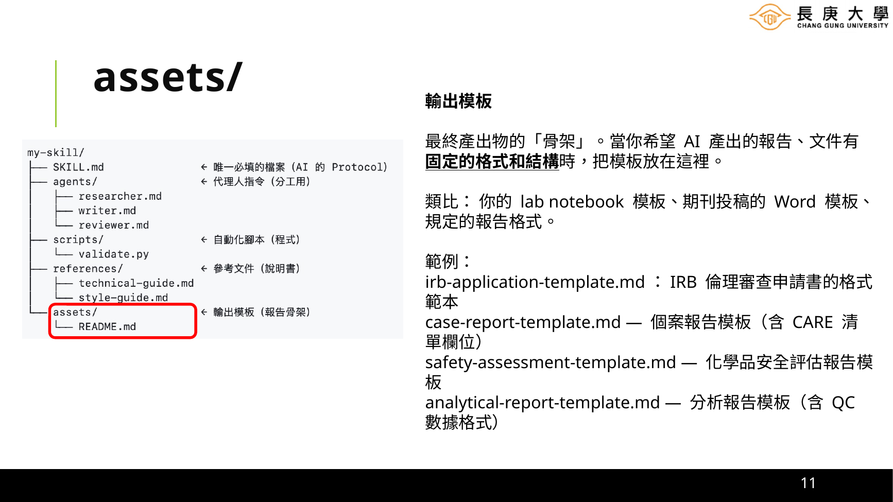

常見範例包括：

- IRB 申請書骨架
- 研究計畫書格式
- 個案報告模板
- 系統性文獻回顧資料表
- 化學品安全評估表
- 期刊投稿 Word 模板
- 分析報告或結案報告範例

範例檔名：

```text
assets/
├── irb-application-template.md
├── literature-review-table.xlsx
├── case-report-template.docx
└── final-report-example.pdf
```

Agent 應被要求依照模板欄位填寫，而不是自行重新設計格式。

---

## 9. 如何把研究需求寫成可執行的 Skill 規格

撰寫需求時，可以先把它當作「交代研究助理完成一項工作」。不要急著寫程式語法，先把研究流程與品質要求說清楚。

### 9.1 先寫粗略草稿

例如：

```text
我想建立一個 PubMed 文獻蒐集的 AI Agents 系統。
第一個 Agent 跟使用者對話，釐清研究領域、關鍵字與文獻類型。
第二個 Agent 到 PubMed 抓取約 30 篇文獻並分類。
第三個 Agent 整理使用者選定分類的摘要。
```

這段已經有基本方向，但仍欠缺：

- 每一階段的輸入與輸出欄位
- 搜尋結果的必要書目資訊
- 無摘要或重複文獻如何處理
- 是否需要 DOI、PMID
- 使用者在哪一個階段確認
- 如何驗證結果
- 最終輸出檔案格式

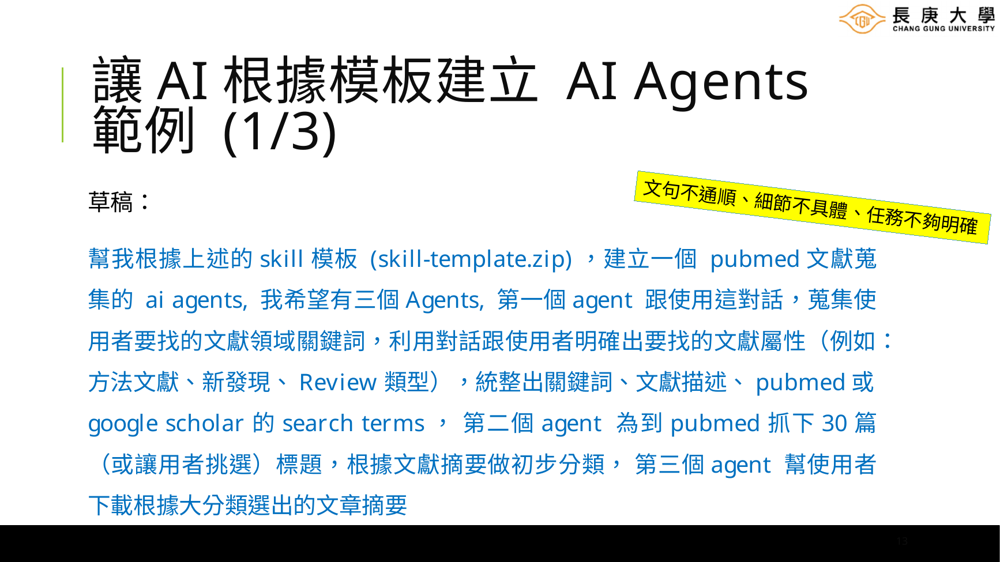

### 9.2 請 AI 先潤飾需求

可以先把草稿貼到任一個 AI，要求：

```text
請將以下需求改寫成明確、可執行的 AI Skill 開發規格。
請補充每一個 Agent 的角色、輸入、工作步驟、輸出格式、錯誤處理與資料流。
不要直接實作，先輸出完整規格供我確認。
```

### 9.3 改寫成完整規格

以下是一份較完整的範例：

```text
請根據提供的 skill 模板（skill-template.zip），建立一個用於 PubMed
文獻蒐集的 AI Agents 系統。

系統需包含三個 Agent：

Agent 1：需求釐清與搜尋策略生成
- 與使用者對話，釐清研究主題、研究對象、介入、比較、結果、研究設計、
  年份、語言與文獻類型。
- 整理 Keywords、Research Intent，以及可用於 PubMed 的 Search Queries。
- 在執行搜尋前，先請使用者確認搜尋策略。

Agent 2：文獻抓取與初步分類
- 根據已確認的搜尋式，從 PubMed 擷取預設 30 篇文獻；使用者可調整數量。
- 儲存 PMID、DOI、標題、作者、期刊、年份與摘要。
- 去除重複資料，標示缺少摘要的文獻。
- 依研究類型與主題進行初步分類，並輸出分類表供使用者選擇。

Agent 3：摘要整理與輸出
- 根據使用者選定的分類，整理文獻摘要與研究重點。
- 每篇文獻必須保留可查證的 PMID 或 DOI。
- 產生結構化 Markdown 報告與 CSV 書目表。
- 不得自行捏造未出現在來源中的研究結果。

其他要求：
- 依照 skill-template.zip 產生 SKILL.md、agents、scripts、references 與 assets
  中必要的檔案。
- 系統架構需明確呈現三個 Agent 的資料流與交接格式。
- 若 PubMed API 失敗，需提供錯誤訊息、重試方式與人工替代流程。
- 產生 README.md，說明安裝、使用方式、範例與測試方法。
```

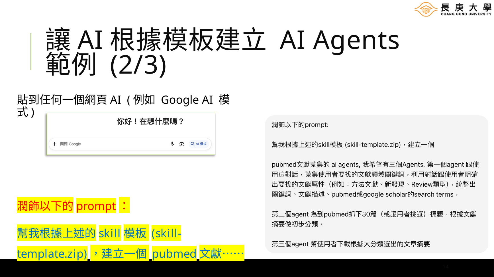

---

## 10. 可直接套用的研究 Skill 需求模板

將下列內容複製後，依自己的研究需求填寫中括號：

```text
請根據我提供的 skill-template.zip，建立一個「[Skill 名稱]」研究用 AI Skill。

一、目的
此 Skill 用於：[描述希望解決的研究問題或工作流程]。
主要使用者為：[研究人員／研究助理／教師／學生／臨床人員]。

二、啟用條件
當使用者提出以下需求時啟用：
- [情境 1]
- [情境 2]
- [情境 3]

以下情況不應啟用：
- [排除情境 1]
- [排除情境 2]

三、Agent 分工
Agent 1：[角色名稱]
- 目的：
- 輸入：
- 工作步驟：
- 輸出：
- 不可執行事項：

Agent 2：[角色名稱]
- 目的：
- 輸入：
- 工作步驟：
- 輸出：
- 不可執行事項：

Agent 3：[角色名稱]
- 目的：
- 輸入：
- 工作步驟：
- 輸出：
- 不可執行事項：

四、資料來源
- 必須使用：[資料庫、API、使用者提供文件]
- 可選資料來源：[其他來源]
- 禁止使用：[不可信或不適合的來源]

五、程式需求
- 是否需要 scripts：[是／否]
- 預計功能：[搜尋、資料清理、統計、轉檔、驗證]
- 錯誤處理：[API 失敗、欄位缺漏、格式錯誤時的處理方式]

六、參考資料
- [SOP、指南、詞彙表、評分標準]
- 說明何時需要讀取各檔案。

七、輸出格式
最終輸出必須包含：
- [欄位或章節 1]
- [欄位或章節 2]
- [欄位或章節 3]

輸出檔案格式：[Markdown／DOCX／CSV／XLSX／JSON／PDF]

八、品質與驗證
- 不得捏造資料或引用。
- 無法確認的資訊應明確標示。
- 每一筆外部資料須保留可查證識別碼或來源連結。
- 完成後執行：[人工抽查、程式驗證、交叉比對、格式檢查]。

九、交付內容
請產生：
- SKILL.md
- 必要的 agents/*.md
- 必要的 scripts/*
- 必要的 references/* 說明
- 必要的 assets/* 範本
- README.md
- 測試案例與預期結果

請先檢查整體架構、Agent 分工與資料流是否合理，再產生全部檔案。
```

---

## 11. 如何測試 Skill

Skill 建立完成後，不要只檢查檔案是否存在，還需要測試它是否真的會在正確時機啟用，以及輸出是否符合研究需求。

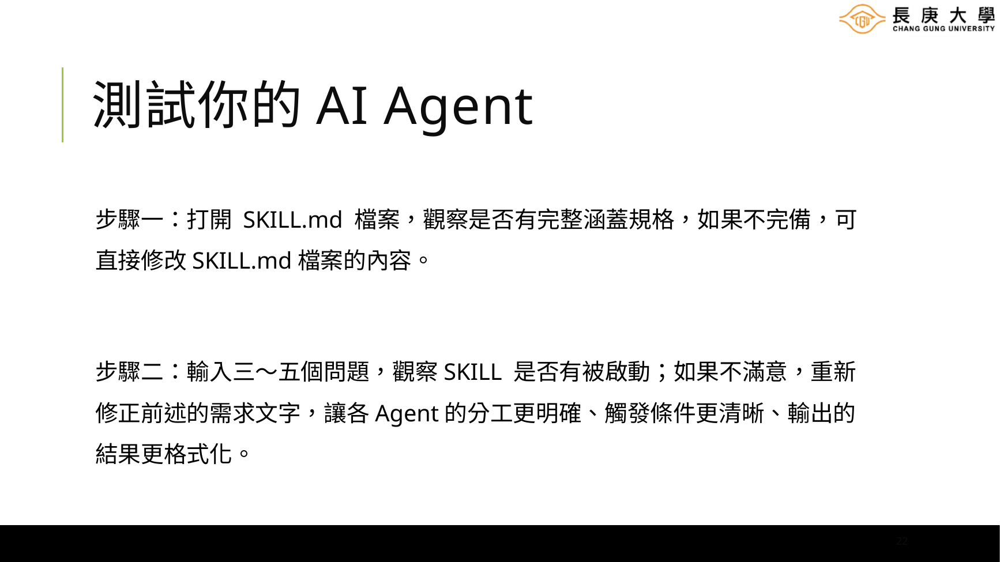

### 步驟一：檢查 `SKILL.md`

確認是否包含：

- 清楚的名稱與 description
- 明確的啟用與排除條件
- 完整工作流程
- Agent 分工與交接方式
- 輸出格式
- 驗證與錯誤處理

### 步驟二：準備 3～5 個正向測試問題

例如：

```text
請幫我搜尋近五年關於間歇性斷食與第二型糖尿病的隨機對照試驗。
```

```text
我想確認這份參考文獻清單中的 DOI 與文章是否真實存在。
```

```text
請依照我的研究假設，整理支持與反對的文獻證據。
```

### 步驟三：準備不應觸發的測試問題

例如文獻 Skill 不應因以下問題啟動：

```text
請幫我潤飾這封會議邀請信。
```

### 步驟四：檢查 Agent 是否越權

例如搜尋 Agent 不應直接下研究結論；報告 Agent 不應自行補寫不存在的文獻資料。

### 步驟五：檢查輸出是否可驗證

研究相關輸出至少應保留：

- DOI、PMID、資料庫識別碼或來源
- 搜尋日期
- 搜尋式
- 納入與排除原則
- 無法確認或缺漏資料的標記

### 步驟六：反覆修正

若 Skill 沒有被啟動，可修改 `description` 與啟用條件；若結果不穩定，可增加輸出 schema、範例與檢查規則。

---

## 12. 研究工作中特別重要的品質規則

研究用 Skill 與一般文字助理不同，應優先考慮可追溯性與可驗證性。

### 12.1 不捏造來源

不得產生不存在的 DOI、PMID、作者、期刊或研究結果。無法查證時，要標示為「未確認」。

### 12.2 保留完整搜尋紀錄

文獻搜尋應保存：

- 資料庫名稱
- 搜尋日期
- 完整搜尋式
- 結果數量
- 篩選條件
- 去除重複的方式

### 12.3 區分原始資料與 AI 推論

輸出中應清楚區分：

- 文獻原始資訊
- 摘要中的內容
- AI 的整理或推論
- 使用者最後的判斷

### 12.4 設計人工確認節點

建議在以下階段暫停，請使用者確認後再繼續：

1. 研究問題與搜尋策略完成後
2. 初步分類完成後
3. 最終結論與引用清單輸出前

### 12.5 高風險內容不得直接取代專業判斷

涉及臨床、法律、倫理、統計推論或實驗安全時，Skill 應明確要求人工審查，不應把 AI 產出視為最終決策。

---

## 13. 範例：參考資料檢查器

這類 Skill 可協助研究人員逐筆確認引用是否真實存在，並比對標題、作者、年份、期刊、DOI 與 PMID。

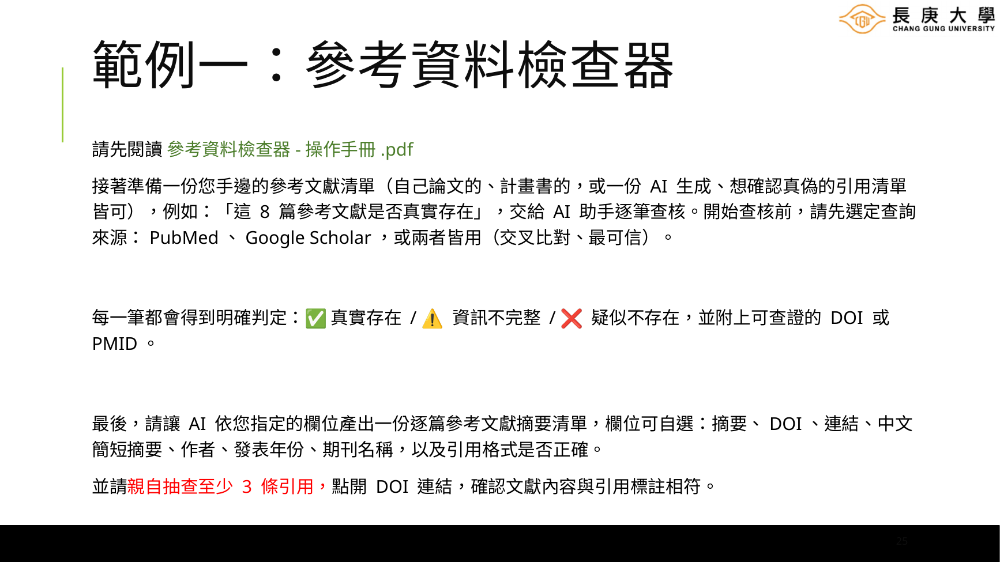

建議工作流程：

1. 使用者提供參考文獻清單。
2. 使用者指定 PubMed、Google Scholar 或兩者交叉比對。
3. Agent 逐筆搜尋並比對書目欄位。
4. 對每一筆給出明確判定：
   - ✅ 真實存在
   - ⚠️ 資訊不完整或部分不符
   - ❌ 疑似不存在
5. 輸出 DOI、PMID、來源與差異說明。
6. 使用者親自抽查至少 3 筆。

### 必要品質規則

- 搜不到不代表一定不存在，應寫成「在指定來源中未查得」。
- DOI 能開啟不代表引用內容完全正確，仍須比對標題與作者。
- 不要只根據搜尋摘要判定。
- 應保存查詢來源與查詢日期。

---

## 14. 範例：研究計畫參考文獻建立器

此 Skill 可從研究假設出發，同時蒐集支持與反對證據，避免只挑選符合預期的文獻。

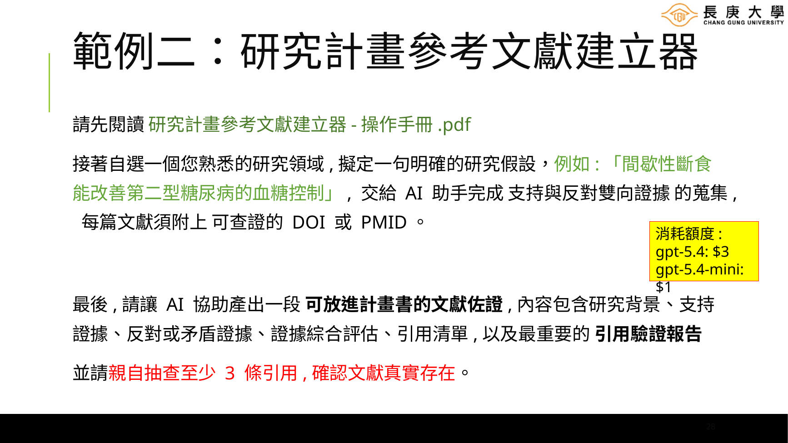

建議輸出包括：

- 研究背景
- 支持證據
- 反對或矛盾證據
- 證據品質與限制
- 綜合評估
- 可放入計畫書的文字草稿
- 完整引用清單
- 引用驗證報告

重要原則：每篇文獻都必須附上可查證的 DOI、PMID 或正式資料庫紀錄，並由研究人員抽查。

---

## 15. 模型與成本的使用策略

建立 Skill 與執行 Skill，可以採用不同等級的模型：

- **建立階段**：使用推理能力較強的模型，負責規劃架構、分工、程式與品質規則。
- **日常執行**：大量、明確、可驗證的子任務可交給較小型模型。
- **最終判斷**：跨文件整合、複雜推論或高風險內容，再交由較強模型處理。

模型名稱、價格與功能會隨平台更新，因此不建議把特定版本與費用直接寫死在 Skill 裡。較穩定的寫法是用能力分類：

```text
planner_model: 高推理能力模型
worker_model: 成本較低的小型模型
reviewer_model: 高準確度模型
```

---

## 16. 建議的 GitHub 專案結構

```text
research-skill-template/
├── README.md
├── skill-template.zip
├── examples/
│   ├── pubmed-literature-collector/
│   ├── reference-verifier/
│   └── proposal-evidence-builder/
├── docs/
│   ├── getting-started.md
│   ├── testing-guide.md
│   └── research-quality-checklist.md
└── assets/
    └── images/
```

### README 首頁建議包含

- 本專案用途
- 適合對象
- 下載範本方式
- 最短使用流程
- 一份可複製的需求模板
- 範例專案
- 研究品質與引用驗證提醒

---

## 17. 發布前檢查清單

### 架構

- [ ] `SKILL.md` 存在且可獨立理解
- [ ] 每個 Agent 只負責一個主要功能
- [ ] Agent 之間的輸入與輸出格式一致
- [ ] 非必要資料未塞入主要上下文

### 研究品質

- [ ] 禁止捏造來源與數據
- [ ] 保留搜尋式與查詢日期
- [ ] 外部資料包含 DOI、PMID 或可查證來源
- [ ] AI 推論與原始資料有清楚區隔
- [ ] 設有人工確認節點

### 技術

- [ ] scripts 有錯誤處理
- [ ] API 金鑰不寫入版本控制
- [ ] 機密資料不放入公開儲存庫
- [ ] 範例資料已去識別化
- [ ] README 說明安裝與測試方式

### 測試

- [ ] 至少測試 3～5 個正向案例
- [ ] 至少測試 2 個不應啟用的案例
- [ ] 測試缺少資料、API 失敗與格式錯誤
- [ ] 人工抽查關鍵輸出

---

## 18. 最短操作流程

對第一次建立 Skill 的研究人員，可以只記住以下六步：

1. **選範本**：下載並解壓縮 [`skill-template.zip`](https://github.com/chichingleetw/research-skill-template-guide/raw/main/skill-template.zip)。
2. **寫需求**：像交代研究助理一樣，描述任務、流程與產出。
3. **拆分工**：一個 Agent 負責一項主要工作。
4. **交給 AI 建立**：要求 AI 產生所有必要檔案與 README。
5. **實際測試**：使用真實研究問題測試 3～5 次。
6. **修正與驗證**：調整觸發條件、輸出格式與查核規則。

Skill 的格式很有彈性，不需要第一次就建立完整而複雜的系統。先完成可以實際使用的版本，再根據研究流程逐步擴充，通常最有效率。

---

## 授權與使用提醒

本指南可作為研究教學與 Skill 建立的參考文件。公開到 GitHub 前，請確認投影片圖片、範例文件、商標、期刊模板與第三方資料是否具備適當的使用權限。

研究者仍需對研究設計、文獻判讀、資料分析、引用正確性與研究倫理負最終責任。
